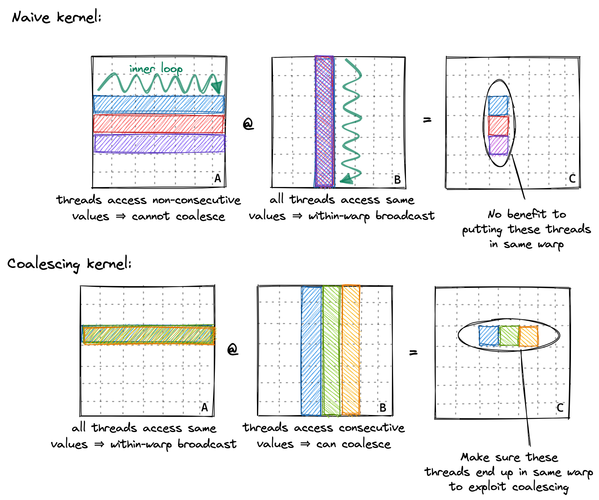

<!-- Workshop Slides Template
     Replace all [PLACEHOLDER] content with your workshop-specific material
     Structure based on successful Modular workshop formats
-->

## Why matrix multiplication remains one of the most important problems

---

## Agenda

**1. Matrix Multiplication**
<!-- .element: class="fragment" data-fragment-index="1" -->

**2. Matrix Multiplication and LLMs**
<!-- .element: class="fragment" data-fragment-index="2" -->

**3. Naive Implementations**
<!-- .element: class="fragment" data-fragment-index="3" -->

**4. Memory Coalesing**
<!-- .element: class="fragment" data-fragment-index="4" -->

**5. Shared Memory Tiling**
<!-- .element: class="fragment" data-fragment-index="5" -->

**6. Tensor Cores**
<!-- .element: class="fragment" data-fragment-index="6" -->

**7. Bonus - Flash Attention**
<!-- .element: class="fragment" data-fragment-index="7" -->

--


---

## Who Am I?

--

### Chris Hoge
- Developer Relations Manager at Modular
- Studied Applied Mathematics
- Involved in open source infrastructure and computation projects for over a decade
- hoge@modular.com

---

**1. Matrix Multiplication**

--

**1. Matrix Multiplication**

Given two dense matrices $A$ and $B$ of dimensions $M\times K$ and $K\times N$ respectively, we want to compute the matrix multiplication  $C = A . B$ which is defined by:

$$
C_{i,j} = \sum_{k \in [0 \cdots K)} A_{i,k} B_{k,j}
$$

--

Visually, *matmul* is the dot product of every row of matrix $A$ with every column of
matrix $B$, with the results stored in matrix $C$.


--

Written as pseudo-code, *matmul* is:

```python
for row in range(M):
  for col in range(N):
    C[row][col] = 0
    for inner in range(K):
      C[row][col] += A[row][inner]*B[inner][col]
```

--

Conceptually, *matmul* projects a $K$-sized set of $M$ dimensional vectors to an $M$ dimensional space.


---

**2. Matrix Multiplication in LLMs**

All LLMs, be it Meta's Llama, Alibaba's Qwen, Deepseek, Anthropics' Claude, OpenAI's ChatGPT, or Google's Gemini, utilize *matmuls* at their core. 

--

These *matmuls* might be disguised under multiple names, for instance, the Multi-Layer Perceptron (MLP), which is sometimes called the Linear layer, is an $A.B^T$ matmul operation. 


--

The same is true for Attention, Latent Attention, Mixture of Experts, and so on.


--

For example, over **83%** of llama-8B's runtime is occupied executing some variant of *matmul*.


---

Let's get started!

**To begin, we need to set up the MAX Graph Interface.**

--

The MAX Graph Interface is a high-performance computation framework that lets you build
and execute efficient machine learning models.

*It provides a flexible way to define computational workflows as graphs using
a Python API.*

--

Setting up the MAX Graph interface in Python 🐍

```python
def matrix_multiplication(
    a: NDArray[np.float32],
    b: NDArray[np.float32],
    algorithm: str,
    session: InferenceSession,
    device: Device,
) -> Tensor:
    dtype = DType.float32

    # Create driver tensors from the input arrays, and move them to the
    # accelerator.
    a_tensor = Tensor.from_numpy(a).to(device)
    b_tensor = Tensor.from_numpy(b).to(device)

    mojo_kernels = Path(__file__).parent / "kernels"

    # Configure our simple one-operation graph.
    with Graph(
        "matrix_multiplication_graph",
        input_types=[
            TensorType(
                dtype,
                shape=a_tensor.shape,
                device=DeviceRef.from_device(device),
            ),
            TensorType(
                dtype,
                shape=b_tensor.shape,
                device=DeviceRef.from_device(device),
            ),
        ],
        custom_extensions=[mojo_kernels],
    ) as graph:
        # Take in the two inputs to the graph.
        a_value, b_value = graph.inputs
        # The matrix multiplication custom operation takes in two matrices and
        # produces a result, with the specific algorithm that is used chosen
        # via compile-time parameterization.
        output = ops.custom(
            name="matrix_multiplication",
            device=DeviceRef.from_device(device),
            values=[a_value, b_value],
            out_types=[
                TensorType(
                    dtype=a_value.tensor.dtype,
                    shape=[a_value.tensor.shape[0], b_value.tensor.shape[1]],
                    device=DeviceRef.from_device(device),
                )
            ],
            parameters={"algorithm": algorithm},
        )[0].tensor
        graph.output(output)

    # Compile the graph.
    print("Compiling...")
    model = session.load(graph)

    # Perform the calculation on the target device.
    print("Executing...")
    result = model.execute(a_tensor, b_tensor)[0]

    # Copy values back to the CPU to be read.
    assert isinstance(result, Tensor)
    return result.to(CPU())
  ```

---

**3a. Naive *matmul* in Mojo on CPU**

--

A Mojo implementation of the simple *matmul* pseudocode

```mojo
fn naive_matrix_multiplication_cpu(
    output: ManagedTensorSlice,
    a: ManagedTensorSlice[dtype = output.dtype, rank = output.rank],
    b: ManagedTensorSlice[dtype = output.dtype, rank = output.rank],
):
    """A naive matrix multiplication used as a fallback on CPU hardware."""
    var M = a.shape()[0]
    var N = b.shape()[1]
    var K = b.shape()[0]

    for row in range(M):
        for col in range(N):
            for k in range(K):
                output[row, col] = output[row, col] + a[row, k] * b[k, col]
```

--

With the naive algorithm on a 2.5 GHz AMD processor, we achieve:
``` []
| name                       | met (ms)            | iters | GFLOPS             |
| -------------------------- | ------------------- | ----- | ------------------ |
| cpu/naive                  | 1332.5470228181819  | 11    | 1.629729445049621  |
```

<!-- .element: class="fragment" data-fragment-index="0" -->
- The problems:
<!-- .element: class="fragment" data-fragment-index="1" -->
  -  It's serial - no parallelization, either through CPU or GPU cores.
<!-- .element: class="fragment" data-fragment-index="2" -->
  -  $O(n^3)$ for square matrices!
<!-- .element: class="fragment" data-fragment-index="3" -->
- We can do a lot better. Let's work through some optimizations.
<!-- .element: class="fragment" data-fragment-index="4" -->

---

**The limitations of CPUs**

- CPUs are limited to on the number of cores they have
<!-- .element: class="fragment" data-fragment-index="1" -->
- Lower-end CPUs have around 32 cores
<!-- .element: class="fragment" data-fragment-index="2" -->
- High-end CPUs have on the order of 128 cores.
<!-- .element: class="fragment" data-fragment-index="3" -->
- SIMD can give us come additional parallelism, but it's still limited
<!-- .element: class="fragment" data-fragment-index="4" -->

--

**How GPUs can help**

- GPUs, on the other hand, offer massive parallelism
<!-- .element: class="fragment" data-fragment-index="1" --> 
- A modern GPUs can handle over 100,000 threads simultaneously
<!-- .element: class="fragment" data-fragment-index="2" --> 
- This makes them the ideal hardware choice for repetitive, data-parallel operations
<!-- .element: class="fragment" data-fragment-index="3" -->

Like, for example, *matmul*
<!-- .element: class="fragment" data-fragment-index="4" -->

--

**How to think about programming GPUs**

- While in traditional CPU programming we process data sequentially through loops:

```python
# CPU approach
for i in range(data_size):
	result[i] = process(data[i])
```

--

**How to think about programming GPUs**

- In GPU programming, we map thousands of parallel threads directly onto the data:

```python
# GPU approach (conceptual)
thread_id = global_idx.x
result[thread_id] = process(data[thread_id])
```

---

**3b. Naive *matmul* in Mojo on GPU**

The idea: distribute every dot product to a GPU core.
<!-- .element: class="fragment" data-fragment-index="1" --> 

--


--

A Mojo implementation of the simple *matmul* pseudocode for GPUs

```mojo
@__llvm_metadata(MAX_THREADS_PER_BLOCK_METADATA=StaticTuple[Int32, 1](256))
fn naive_matrix_multiplication[
    dtype: DType,
    a_layout: Layout,
    b_layout: Layout,
    c_layout: Layout,
    BM: Int,
    BN: Int,
](
    a: LayoutTensor[dtype, a_layout, MutableAnyOrigin],
    b: LayoutTensor[dtype, b_layout, MutableAnyOrigin],
    c: LayoutTensor[dtype, c_layout, MutableAnyOrigin],
):
    var M = a.dim[0]()
    var N = b.dim[1]()
    var K = b.dim[0]()

    # Calculate the column and row indices for each thread.
    var row = block_dim.x * block_idx.x + thread_idx.x
    var col = block_dim.y * block_idx.y + thread_idx.y

    # Initialize a register to accumulate the result for this thread.
    var dst_reg: c.element_type = 0

    # Iterate over the K dimension to compute the dot product.
    if row < M and col < N:
        for k_index in range(K):
            # Multiply the elements and accumulate the result.
            dst_reg = dst_reg + a[row, k_index] * b[k_index, col]

    # Write the final accumulated result to the output matrix.
    c[row, col] = dst_reg
```

--

The performance:

``` [1-4]
| name                       | met (ms)            | iters | GFLOPS             |
| -------------------------- | ------------------- | ----- | ------------------ |
| cpu/naive                  | 1332.5470228181819  | 11    | 1.629729445049621  |
| gpu/naive                  | 1.5029676736684172  | 1333  | 1444.9353489415876 |
```

---

**4. Optimizing memory access with memory coalescing**

--

- To understand coalesing, we need to understand warps
- Warps are a grouping of 32 threads in a block
<!-- .element: class="fragment" data-fragment-index="2" -->
- Threads in a warp will always execute the same code
<!-- .element: class="fragment" data-fragment-index="3" -->
- Sequential memory access by threads in the same warp can be grouped and executed as one.
<!-- .element: class="fragment" data-fragment-index="4" -->

--


--

In our previous implementation, memory loads into warps were non-sequential


--

To improve performance, adjust memory loading



--

```mojo
fn coalescing_matrix_multiplication[
    dtype: DType,
    a_layout: Layout,
    b_layout: Layout,
    c_layout: Layout,
    BM: Int,
    BN: Int,
](
    a: LayoutTensor[dtype, a_layout, MutableAnyOrigin],
    b: LayoutTensor[dtype, b_layout, MutableAnyOrigin],
    c: LayoutTensor[dtype, c_layout, MutableAnyOrigin],
):

    var M = a.dim[0]()
    var N = b.dim[1]()
    var K = b.dim[0]()

    # Calculate the column and row indices for each thread.
    # Have adjacent threads work on the same row to allow for memory coalescing
    var row = block_dim.y * block_idx.y + thread_idx.y
    var col = block_dim.x * block_idx.x + thread_idx.x

    # Initialize a register to accumulate the result for this thread.
    var dst_reg: c.element_type = 0

    # Iterate over the K dimension to compute the dot product.
    if row < M and col < N:
        for k_index in range(K):
            # Multiply the elements and accumulate the result.
            dst_reg = dst_reg + a[row, k_index] * b[k_index, col]

    # Write the final accumulated result to the output matrix.
    c[row, col] = dst_reg
```

--

*The major difference*

Naive:
```
    # Calculate the column and row indices for each thread.
    var row = block_dim.x * block_idx.x + thread_idx.x
    var col = block_dim.y * block_idx.y + thread_idx.y
```
vs coalesing.
```
    # Calculate the column and row indices for each thread.
    # Have adjacent threads work on the same row to allow for memory coalescing
    var row = block_dim.y * block_idx.y + thread_idx.y
    var col = block_dim.x * block_idx.x + thread_idx.x
```

--

``` [1-2,4-5]
| name                       | met (ms)            | iters | GFLOPS             |
| -------------------------- | ------------------- | ----- | ------------------ |
| cpu/naive                  | 1332.5470228181819  | 11    | 1.629729445049621  |
| gpu/naive                  | 1.5029676736684172  | 1333  | 1444.9353489415876 |
| gpu/coalescing             | 0.8154868439641539  | 1897  | 2663.06088942308   |
```

---

**5. Shared memory tiling**

--

Up to this point, all of our kernels have loaded data directly from global memory.

--

Each SM has shared local memory which provides much faster access to blocks.

--


--

The idea is to copy chunks of tiled memory to the SMs, computing portions of the *matmul*, with results stored and accumulated.


--

```mojo [6-8|15-20|22-27|32-37|39-47|49-55|58]
fn tiled_matrix_multiplication[
    dtype: DType,
    a_layout: Layout,
    b_layout: Layout,
    c_layout: Layout,
    BM: Int,
    BN: Int,
    BK: Int,
    NUM_THREADS: Int,
](
    a: LayoutTensor[dtype, a_layout, MutableAnyOrigin],
    b: LayoutTensor[dtype, b_layout, MutableAnyOrigin],
    c: LayoutTensor[dtype, c_layout, MutableAnyOrigin],
):
    # Calculate the column and row indices for each thread
    var col = thread_idx.x % BN
    var row = thread_idx.x // BN

    # Get the tile of the output matrix C that this thread block is responsible for
    var dst = c.tile[BM, BN](block_idx.y, block_idx.x)

    # Allocate shared memory for tiles of input matrices A and B
    var a_smem = tb[dtype]().row_major[BM, BK]().shared().alloc()
    var b_smem = tb[dtype]().row_major[BK, BN]().shared().alloc()

    # Initialize the register to accumulate the result
    var dst_reg: c.element_type = 0

    # Iterate over tiles of input matrices A and B
    for block in range(b.dim[0]() // BK):
        # Define the layout for loading tiles of A and B into shared memory
        alias load_a_layout = Layout.row_major(NUM_THREADS // BK, BK)
        alias load_b_layout = Layout.row_major(BK, NUM_THREADS // BK)

        # Get the tiles of A and B for the current iteration
        var a_tile = a.tile[BM, BK](block_idx.y, block)
        var b_tile = b.tile[BK, BN](block, block_idx.x)

        # Asynchronously copy tiles of A and B from global memory to shared memory
        copy_dram_to_sram_async[thread_layout=load_a_layout](a_smem, a_tile)
        copy_dram_to_sram_async[thread_layout=load_b_layout](b_smem, b_tile)

        # Wait for all asynchronous copies to complete
        async_copy_wait_all()

        # Synchronize threads to ensure shared memory is populated
        barrier()

        # Perform matrix multiplication on the tiles in shared memory
        @parameter
        for k in range(BK):
            dst_reg += a_smem[row, k] * b_smem[k, col]

        # Synchronize threads before loading the next tiles
        barrier()

    # Write the result to the output matrix
    dst[row, col] += dst_reg
```

--

``` [1-2,5-6]
| name                       | met (ms)            | iters | GFLOPS             |
| -------------------------- | ------------------- | ----- | ------------------ |
| cpu/naive                  | 1332.5470228181819  | 11    | 1.629729445049621  |
| gpu/naive                  | 1.5029676736684172  | 1333  | 1444.9353489415876 |
| gpu/coalescing             | 0.8154868439641539  | 1897  | 2663.06088942308   |
| gpu/tiled                  | 0.46889512          | 2800  | 4631.50719077648   |
| gpu/tiled_register         | 0.24080273739130437 | 4600  | 9018.548308572601  |
| gpu/block_tiled            | 0.28845984749790327 | 7154  | 7528.573348551693  |
| gpu/block_tiled_vectorized | 0.2990510069135803  | 8100  | 7261.94217639794   |
| gpu/tensor_core            | 0.16754319564102563 | 7800  | 12961.977427319805 |
```

---

**6. Tensor Cores**

--

It's beyond the scope of this talk to dive in much deeper, but it's important to note
that all of the previous examples are using *traditional* GPU programming techniques.

--

Modern GPUs include specialized processors called *Tensor Cores* that are optimized
to perform the *Matrix-Multiply-Accumulate (MMA)* operations.

--

MAX contains interfaces that make it more ergonomic to program these dedicated hardware units.

--

``` [1-2,6,10]
| name                       | met (ms)            | iters | GFLOPS             |
| -------------------------- | ------------------- | ----- | ------------------ |
| cpu/naive                  | 1332.5470228181819  | 11    | 1.629729445049621  |
| gpu/naive                  | 1.5029676736684172  | 1333  | 1444.9353489415876 |
| gpu/coalescing             | 0.8154868439641539  | 1897  | 2663.06088942308   |
| gpu/tiled                  | 0.46889512          | 2800  | 4631.50719077648   |
| gpu/tiled_register         | 0.24080273739130437 | 4600  | 9018.548308572601  |
| gpu/block_tiled            | 0.28845984749790327 | 7154  | 7528.573348551693  |
| gpu/block_tiled_vectorized | 0.2990510069135803  | 8100  | 7261.94217639794   |
| gpu/tensor_core            | 0.16754319564102563 | 7800  | 12961.977427319805 |
```

---

While MAX and other accelerator libraries will provide you with pre-optimized *matmul* operators,
understanding the optimizations behind *matmul* are useful for developing other GPU optimizations.

--

**7. Flash Attention**

--

The attention mechanism for LLMs consists of several *matmuls* enclosed in a non-linear *softmax* operation.


--

Instead of materializing the entire attention matrix in memory at once, Flash Attention uses a tiling approach where it processes small chunks of queries, keys, and values sequentially, computing attention scores and applying softmax in an "online" manner within each tile.

--

The key innovation is the online softmax technique that maintains running statistics across tiles, allowing it to compute numerically stable softmax without needing the entire row of attention scores.


--

For more information on the relationship between fast *matmul* and Flash Attention, check out

https://modular.github.io/modular/matmul-to-flash-attention

---

**Additional Resources**

- This talk: https://github.com/modular/workshops
- *matmul* custom op tutorial: https://docs.modular.com/max/tutorials/custom-ops-matmul/
- Simon Boehm's *matmul* optimization notebook: https://siboehm.com/articles/22/CUDA-MMM

- Modular community: https://www.modular.com/community

--

We're hiring!

- [Cloud Inference Tech Lead](https://www.modular.com/company/career-post?4584393005&gh_jid=4584393005)
- [GenAI Performance Engineer](https://www.modular.com/company/career-post?4522385005&gh_jid=4522385005)
- [GPU Kernel Engineering Manager](https://www.modular.com/company/career-post?4589475005&gh_jid=4589475005)
- [Lead AI Graph Compiler Engineer](https://www.modular.com/company/career-post?4584207005&gh_jid=4584207005)
- [Senior AI Modeling Engineer](https://www.modular.com/company/career-post?4563359005&gh_jid=4563359005)
- [Software Engineer, GenAI Serving](https://www.modular.com/company/career-post?4522365005&gh_jid=4522365005)

--

Questions?


