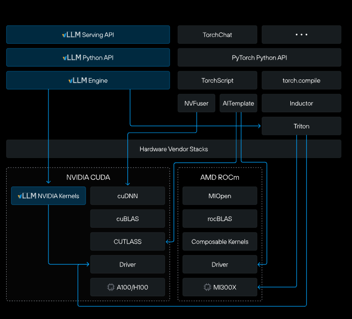
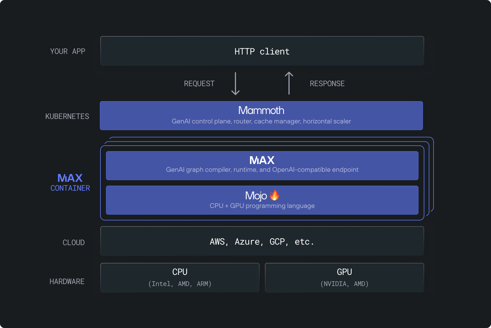

<!-- Original Outline (for reference):
1. Intro: want to present a new way integrating PyTorch with MAX and Mojo
2. Target audience: familiar with PT and cares about TCO beyond NVIDIA. Provide alternative AI software world.
3. High-level view of the Modular stack -> Why? link to Chris's extensive blog of
4. Why you should care? HW-agnostic, TCO, link to recent joint blogs, Inworld, Tensorwave, SFCompute
-->

## Bridging PyTorch with MAX🧑‍🚀 and Mojo🔥

<div style="text-align: center;">

</div>

<aside class="notes">
- Welcome everyone, introduce yourself
- This is about practical performance gains, not just theory
- Promise: by the end, you'll have a clear path to reduce AI costs
- Energy: This is exciting stuff that's happening RIGHT NOW
</aside>

---

## Agenda

**The Problem**: Current AI infrastructure challenges
<!-- .element: class="fragment" data-fragment-index="1" -->

**The Solution**: Modular's MAX🧑‍🚀 and Mojo🔥 stack
<!-- .element: class="fragment" data-fragment-index="2" -->

**Real Impact**: Production success stories
<!-- .element: class="fragment" data-fragment-index="3" -->

**Hands-on**: Custom ops made easy
<!-- .element: class="fragment" data-fragment-index="4" -->

**Live Demo**: See it in action
<!-- .element: class="fragment" data-fragment-index="5" -->

<aside class="notes">
- Today, we're going to explore an exciting new approach to AI software development that combines the familiar PyTorch ecosystem with the revolutionary performance of MAX🧑‍🚀 and Mojo🔥.
- Emphasize "familiar PyTorch ecosystem" - not asking them to throw away their work
- "Revolutionary performance" - this is measurable, not marketing speak
- The paradigm shift: keep what works, dramatically improve what doesn't
- Set expectation: this is practical, not theoretical
- Timeline: about 30 minutes total
</aside>

---

## Who This Talk Is For

**You should pay attention if you:**
- Are currently using PyTorch models for inference
- Care about Total Cost of Ownership (TCO) beyond just NVIDIA GPUs
- Want to future-proof your AI infrastructure
- Are tired of vendor lock-in and hardware limitations
- Need to optimize inference costs at scale

<aside class="notes">
- Ask for show of hands: "How many are using PyTorch in production?"
- TCO emphasis: "Anyone feeling the pain of GPU costs lately?"
- Vendor lock-in: "Ever tried to switch from CUDA to something else?"
- Future-proof: "What happens when new AI chips come out?"
- Promise: "You'll leave with actionable steps, not just concepts"
</aside>

---

<!-- .slide: class="center-slide" -->
## The Modular Stack: Rethinking the AI Infrastructure

Love to know the all the details? 👇
[www.modular.com/democratizing-ai-compute](https://www.modular.com/democratizing-ai-compute)

---

### The Problem with Today's AI Stack

<div style="display: flex; align-items: center; justify-content: space-between;">
<div style="flex: 1; padding-right: 20px;">

- **Vendor Lock-in**: Tied to specific hardware (primarily NVIDIA)
- **Complexity**: Multiple tools, languages, poorly composable part and several optimization layers
- **Performance Gaps**: Significant overhead in traditional frameworks
- **Cost Escalation**: Expensive compute with limited alternatives

</div>
<div style="flex: 0 0 400px; text-align: center;">

</div>
</div>

---

<!-- .slide: class="center-slide" -->
### The Problem with Today's AI Stack

<div style="text-align: center;">

</div>

---

<!-- .slide: class="center-slide" -->
# Enter Modular🚪

---

<!-- .slide: class="center-slide" -->
### Modular's Solution


<div style="text-align: center;">

</div>

---

### Battery-included `pip install modular`*

<small>*Temporary PyTorch dependencies requires including these extras which we'll eliminate soon</small>
<small> Check out [docs.modular.com/max/get-started](https://docs.modular.com/max/get-started)</small>

Smaller packages:

- `pip install max`
- `pip install mojo` (Coming Soon!)

---

### What's MAX🧑‍🚀?

**MAX is Modular's AI Framework**

- 🔥 **Mojo Programming Language** - System-level performance with Python syntax
- 📊 **Python Graph API** - Familiar PyTorch-like interface
- ⚙️ **Graph Compiler** - Automatic optimization and fusion
- 🚀 **Inference Server** - Production-ready deployment
- 💎 **Optimized GPU Kernels** - Hardware-specific optimizations
- 🔧 **Hardware Abstraction** - Write once, run anywhere

<aside class="notes">
- MAX is the complete AI framework - not just a library
- Mojo: "The language built for AI workloads"
- Graph compiler: "Automatic fusion and optimization - you don't need to think about it"
- Inference server: "Production ready out of the box"
- Hardware abstraction: "Same code runs on NVIDIA, AMD, Intel, whatever comes next"
</aside>

---

### What's Mojo🔥?

<div style="display: flex; align-items: center; justify-content: space-between;">
<div style="flex: 1; padding-right: 20px;">

- 🤝 **Heterogenous _System_ Programming Language**
- 🐍 **Python-compatible Syntax**
- ⚡ **Zero-cost Abstractions**
- 🛡️ **Strong Type System**
- 🦀 **Memory Safety**
- 🚀 **C/C++ Performance**

</div>
<div style="flex: 0 0 350px;">

```mojo
def main():
    print("Hello, world!")

fn foo(x: SIMD) -> SIMD:
    return x + 1

struct Foo:
    var x: Int

    fn __init__(out):
        self.x = 0

trait Bar:
    ...

```

</div>
</div>

<aside class="notes">
- Heterogenous: "One language for high-level AI and low-level systems code"
- Python-compatible: "Your existing Python knowledge transfers directly"
- Zero-cost: "High-level abstractions that compile to optimal machine code"
- Type system: "Optional but powerful - catches errors at compile time"
- Memory safety: "Rust-like safety guarantees without garbage collection"
- Mojo: "Chris Lattner - created Swift at Apple, LLVM compiler infrastructure"
</aside>

---

<!-- .slide: class="center-slide" -->
## Why You Should Care🧐

---

### 🚀 Hardware Agnostic Performance
- **Run anywhere**: CPUs, GPUs and emerging AI accelerators
- **No vendor lock-in**: Freedom to choose the best hardware for your use case
- **Future-proof**: Automatically benefit from new hardware without code changes

---

### 💰 Total Cost of Ownership (TCO)
- **Up to 10x cost reduction** compared to traditional GPU inference
- **Efficient utilization** of existing hardware resources
- **Reduced operational complexity** and maintenance overhead
    * Modular container size ~ 1.3GB
    * vLLM container size ~ 9.8GB

---

### 🌟 Proven in Production

Recent success stories and partnerships:

- **Inworld**: [synthesized audio on average ~70% faster if compared to vanilla vLLM-based implementation on NVIDIA B200](https://inworld.ai/blog/how-we-made-state-of-the-art-speech-synthesis-scalable-with-modular)

- **Tensorwave**: [Save up to 70% with MAX, the fastest inference engine on AMD MI325X compute](https://tensorwave.com/blog/save-up-to-70-with-max-the-fastest-inference-engine-on-amd-compute)

These aren't just marketing claims - they're real-world results from companies betting their business on this technology.

<aside class="notes">
- Hardware agnostic: "Imagine deploying the same model on AWS CPUs, Google TPUs, or new AI chips"
- No vendor lock-in: "Choose hardware based on price/performance, not software constraints"
- 10x cost reduction: "Real numbers from real deployments - we'll see specifics in demo"
- Efficient utilization: "Getting more out of hardware you already have"
- Inworld: "AI characters for gaming/virtual worlds - inference-heavy workload"
- Tensorwave: "Cloud inference provider - they need maximum efficiency"
- SFCompute: "Building alternative to traditional cloud AI services"
- Emphasize: "These companies are betting real money on this technology"
</aside>

---

<!-- .slide: class="center-slide" -->
## Now Let's Get Hands-On💻

---

<!-- .slide: class="center-slide" -->
## PyTorch Custom Ops with MAX🧑‍🚀 and Mojo🔥

*From complex C++ extensions to simple, performant solutions*

<aside class="notes">
- "Now that you've seen the big picture and real results"
- "Let's dive into something you can use immediately"
- "If you've ever tried to write custom PyTorch operations, this will be eye-opening"
- "We're going to show you how painful it used to be, and how simple it is now"
</aside>

---

### Traditional PyTorch C++ Extensions: The Hard Way

<div style="display: flex; align-items: flex-start; justify-content: space-between;">
<div style="flex: 1; padding-right: 20px;">

**What you need to do:**
- Write C++/CUDA code
- Configure CMake or setuptools
- Handle Python bindings manually
- 🏗️ Compile for each platform
- 🐛 Debug across languages
- 📚 Learn PyTorch C++ API
- Handle memory management
- Deal with CUDA kernels

</div>
<div style="flex: 1;">

```cpp
// custom_op.cpp
#include <torch/extension.h>

torch::Tensor custom_add_cuda(
    torch::Tensor input1,
    torch::Tensor input2) {
    // CUDA kernel launch
    // Memory management
    // Error handling
    // ... 50+ lines of boilerplate
    return output;
}

PYBIND11_MODULE(TORCH_EXTENSION_NAME, m) {
    m.def("custom_add", &custom_add_cuda,
          "Custom addition (CUDA)");
}
```

</div>
</div>

<aside class="notes">
- Point out the complexity: "Anyone here tried writing PyTorch C++ extensions?"
- Emphasize pain points: "Multiple languages, build systems, platform issues"
- "This is just for a simple add operation - imagine something complex"
- "And you still haven't optimized for different hardware"
</aside>

---

### Traditional PyTorch C++ Extensions: Build Complexity

**setup.py configuration:**
```python
from setuptools import setup
from torch.utils.cpp_extension import BuildExtension, CUDAExtension

setup(
    name='custom_ops',
    ext_modules=[
        CUDAExtension(
            'custom_ops',
            ['custom_op.cpp', 'custom_op_cuda.cu'],
            extra_compile_args={
                'cxx': ['-O3'],
                'nvcc': ['-O3', '--use_fast_math']
            }
        )
    ],
    cmdclass={'build_ext': BuildExtension}
)
```

---

**The build process:**
```bash
# Cross your fingers 🤞
python setup.py build_ext --inplace

# Common issues:
# - CUDA version mismatches
# - Compiler compatibility
# - Library path problems
# - Platform-specific failures
# - Hours of debugging...
```

**Result:**
- 🐌 Slow development cycle
- 🔧 Complex maintenance
- 🏗️ Platform-specific builds
- 😫 High barrier to entry

</div>
</div>

<aside class="notes">
- "Look familiar? How many hours have you spent debugging build issues?"
- "Every time PyTorch updates, you might need to rebuild"
- "Want to support AMD GPUs? Start over with ROCm/HIP"
- "This is before you even start optimizing performance"
- "Complex setup just to get started - imagine maintaining this at scale"
</aside>

---

### Now, Let's See the MAX🧑‍🚀 + Mojo🔥 Way

**What you get:**
- 🎯 **Write once, run anywhere**
- 🐍 **Python-like syntax**
- 🚀 **Hardware-agnostic**
- 🔧 **Minimal build configuration**
- 💪 **C/C++ performance**

---

### MAX🧑‍🚀 and Mojo🔥 Custom Op APIs

**Use MAX Python API directly**

```python
import max.torch

@max.torch.graph_op
def custom(x: TensorValue, y: TensorValue) -> TensorValue:
    # use MAX python api here
    # get the benefit of MAX graph compiler
    # for fusion, memory planning etc.
    ...
```

---

### MAX🧑‍🚀 and Mojo🔥 Custom Op APIs

**Or write your Mojo custom GPU kernel and load**

```python
import torch
from max.torch import CustomOpLibrary

op = CustomOpLibrary("/path/to/op")

```

Then use it as a normal op

```python
@torch.compile
def grayscale(pic):
    output = pic.new_empty(pic.shape)
    # Note: destination-passing style with the added `output`
    ops.grayscale(output, pic)
    return output
```

---

## Live Demo

**What we'll demonstrate:**

- Setting up MAX with your existing PyTorch models on NVIDIA or AMD
- Replacing LLM Ops and Layers with MAX

**Interactive Notebook:**
**[🔗 main.ipynb](https://github.com/modular/workshops/tree/main/pytorch-max-bridge/main.ipynb)**

*Clone the repo and run locally, or just follow along*

```bash
git clone https://github.com/modular/workshops
cd workshops/pytorch-max-bridge
```

---

<!-- .slide: class="center-slide" -->
### Custom RoPE Kernel in AMD MI300X

<div style="text-align: center">

</div>

---

## Key Takeaways

* 🔥 **Complex → Simple**: C++ extensions → Python-like Mojo
* 🚀 **Hardware Freedom**: Run anywhere, no vendor lock-in
* 💰 **Real Savings**: 70-85% cost reduction in production
* 🛠️ **Production Ready**: `pip install modular` and integrate today

<aside class="notes">
- "Let's recap what we've covered"
- "Complex to Simple: No more fighting with build systems"
- "Hardware Freedom: Choose hardware based on price/performance"
- "Real savings: These aren't theoretical - companies are seeing this today"
- "Production ready: You can start experimenting right after this talk"
</aside>

---

### 📚 Resources

- **Documentation**: [docs.modular.com](https://docs.modular.com)
- **Source Code**: [github.com/modular/modular](https://github.com/modular/modular)
- **GPU Puzzles**: [puzzles.modular.com](https://puzzles.modular.com)
- **Community**: [forum.modular.com](https://forum.modular.com/) for support and discussion

<aside class="notes">
- "Don't wait - you can start experimenting today"
- "Measure baseline first so you can quantify the improvements"
- "Start with your most expensive workloads - biggest impact first"
- "Community is very active - real engineers helping real problems"
- "Everything you need is freely available"
</aside>

---

<!-- .slide: class="center-slide" -->
# Thank You! 🔥

## Questions & Discussion


<aside class="notes">
- Thank the audience
- Remind them about the notebook link
- Offer to stick around for individual questions
</aside>
